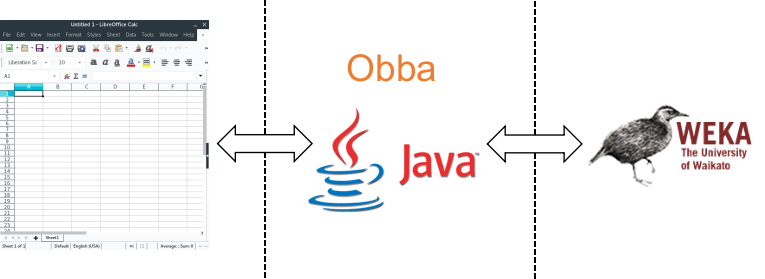
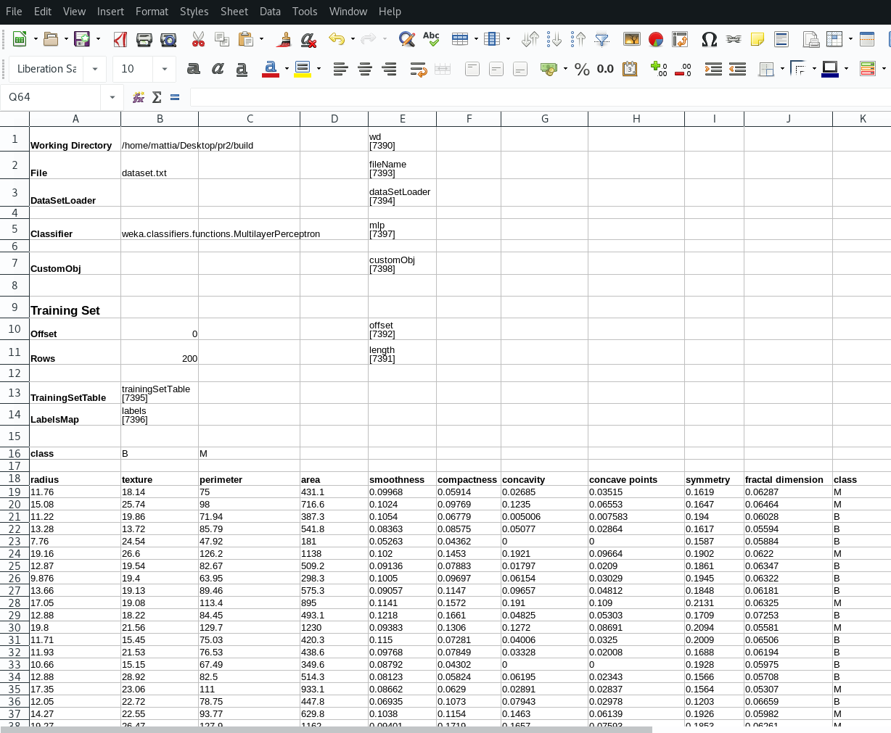
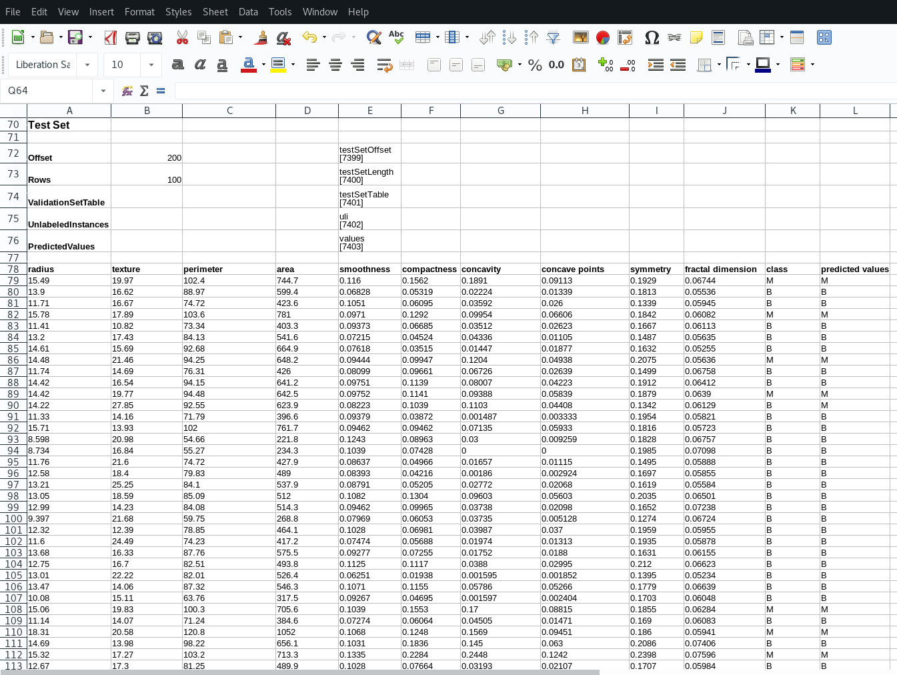
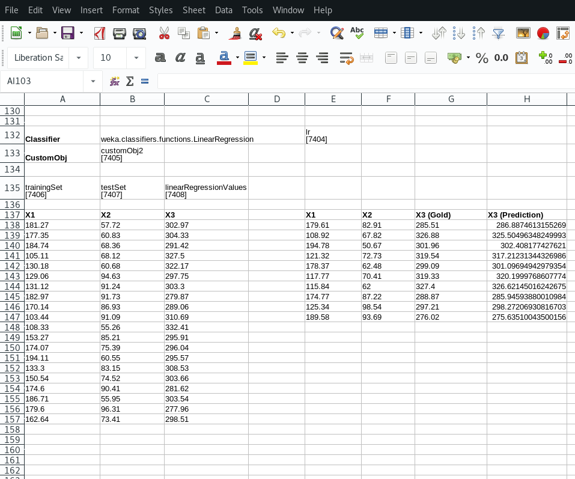

# SpreadML #

## Bringing Machine Learning into Spreadsheets ##

SpreadML is a software framework that allows you to apply Data Mining and Machine Learning techniques directly within your spreadsheets, supporting:

* [Microsoft Excel](https://products.office.com/excel)
* [LibreOffice Calc](https://www.libreoffice.org/discover/calc/)
* [OpenOffice Calc](https://www.openoffice.org/)
* [NeoOffice](https://www.neooffice.org)  


SpreadML relies on [Obba](http://obba.info) to provide a bridge between Spreadsheets and the [Weka](https://www.cs.waikato.ac.nz/ml/weka/) APIs, as shown in the following figure.



The project includes several utilities, allowing the user to:
* load datasets into a spreadsheet;
* perform pre-processing steps;
* create a classifier, given its canonical name in Weka;
* train a classifier;
* apply a previously trained classifier on unlabeled test data.

A working example is shown in the file ```example.ods```. In this case, we are training a neural network (more precisely the classifier weka.classifiers.functions.MultilayerPerceptron) on the dataset ```build/dataset.txt```, that has been obtained through a features-selection step from the [Breast Cancer Wisconsin (Diagnostic) Data Set](http://archive.ics.uci.edu/ml/datasets/Breast+Cancer+Wisconsin+%28Diagnostic%29).
The neural network learns to discriminate whether the fine needle aspiration (FNA) of a breast mass corresponds to a benign or malign tumor.


The ```example.ods``` file shows also a regression example, applying the  weka.classifiers.functions.LinearRegression algorithm on artificial data.

## Get started

First, you need to download and install [Obba](http://obba.info).

If you are using LibreOffice on Ubuntu and you get ```java.lang.reflect.InvocationTargetException```, then you need to install the ```libreoffice-java-common``` package.

```console
$ sudo apt-get install libreoffice-java-common
```

Once Obba has been installed, open the ```example.ods``` file.
You should see that the dataset has been loaded successfully and that the neural network has been trained and applied on the test set.






